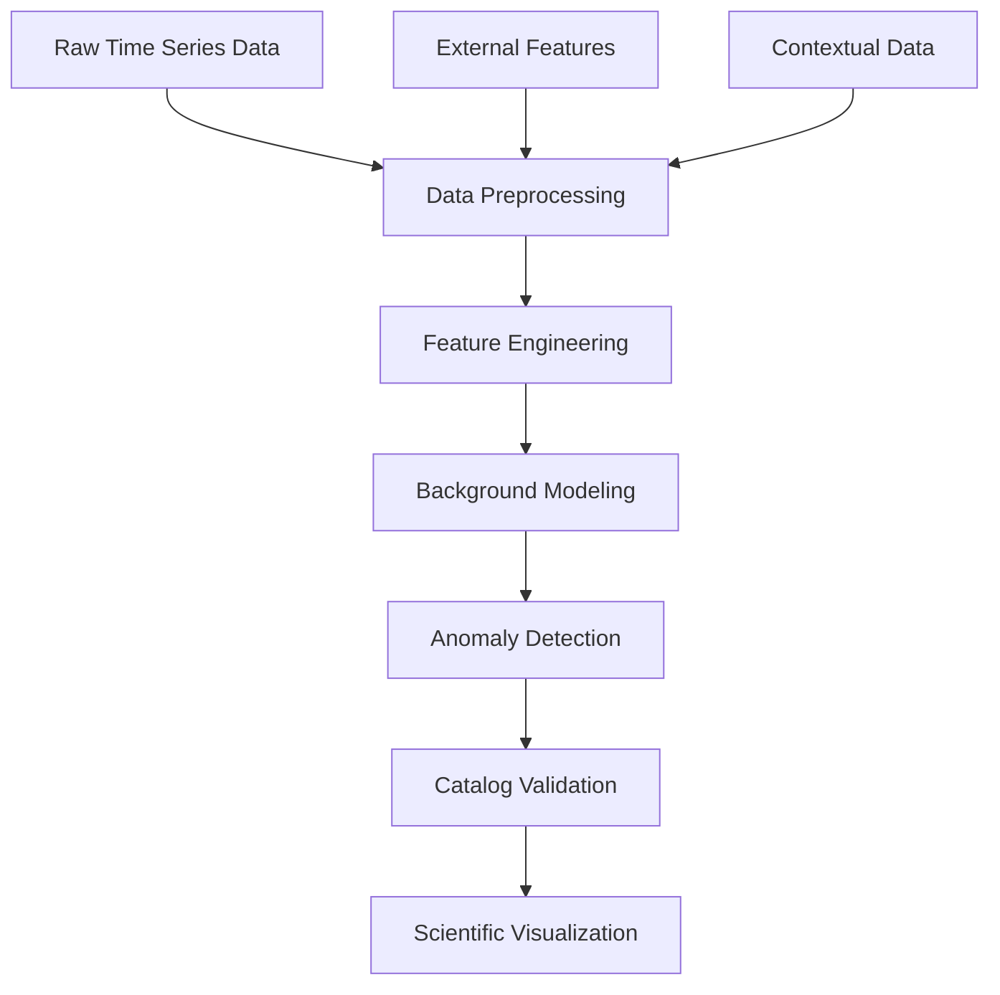

# TSLies - Time Series Anomaly Detection Framework

## What is it?
**TSLies** (Time Series anomaLIES) is an advanced anomaly detection framework using state-of-the-art Machine Learning techniques and the Poisson-FOCuS triggering algorithm for real-time anomaly detection in time series data. This framework provides a comprehensive suite of ML models, from deterministic to Bayesian approaches, for robust background modeling and anomaly detection in any time series dataset.

## Table of contents
- [Main Features](#main-features)
- [Architecture Overview](#architecture-overview)
- [Machine Learning Models](#machine-learning-models)
- [Installation and Dependencies](#installation-and-dependencies)
- [Modules](#modules)
- [Scripts and Pipelines](#scripts-and-pipelines)
- [Usage](#usage)
- [Data Structure](#data-structure)
- [Contributing](#contributing)
- [Contact](#contact)

## Main Features

This repository provides a comprehensive framework for anomaly detection in time series data:

### Core Capabilities
- **Real-time Background Modeling**: Multiple ML architectures for background prediction
- **Bayesian Uncertainty Quantification**: Probabilistic models for reliable anomaly detection
- **Spectral Domain Learning**: Frequency-domain neural networks
- **FOCuS Change Point Detection**: Optimal changepoint detection algorithm
- **Multi-dataset Validation**: Cross-referencing with external event catalogs and metadata
- **Automated Visualization**: Scientific plotting with LaTeX formatting

### Key Innovations
- **Hybrid Model Ensemble**: Combination of deterministic and Bayesian approaches
- **Modular Architecture**: Individual files for each ML model type for maximum maintainability
- **Scalable Pipeline Architecture**: Modular design for large-scale data processing
- **Advanced Uncertainty Handling**: Critical for low false-positive anomaly detection

## Architecture Overview

The framework follows a modular, three-stage pipeline architecture suitable for any time series anomaly detection task:



### Data Flow
1. **Input Integration**: Time series data, external features, contextual information
2. **Background Prediction**: ML models predict normal system behavior
3. **Anomaly Detection**: FOCuS algorithm identifies deviations from background
4. **Validation**: Cross-reference detections with known event catalogs or external metadata
5. **Analysis**: Generate scientific plots and performance metrics

## Machine Learning Models

### Deterministic Models
- **FFNNPredictor**: Feed-Forward Neural Network for baseline background modeling
- **SpectralDomainFFNNPredictor**: Novel frequency-domain neural network using FFT-based loss functions
- **RNNPredictor**: Recurrent Neural Network for temporal dependencies

### Bayesian Models (with Uncertainty Quantification)
- **BNNPredictor**: Bayesian Neural Network with variational inference
- **PBNNPredictor**: Probabilistic Bayesian Neural Network with enhanced uncertainty
- **ABNNPredictor**: Approximate Bayesian Neural Network for computational efficiency
- **MCMCBNNPredictor**: MCMC-based Bayesian Neural Network for full posterior sampling

### Non-Parametric Models
- **MedianKNeighborsRegressor**: K-Nearest Neighbors with median aggregation
- **MultiMeanKNeighborsRegressor**: Multi-output K-NN for baseline comparisons

### Model Selection Criteria
- **Uncertainty Quantification**: Essential for reliable anomaly detection
- **Computational Efficiency**: Real-time processing requirements
- **Interpretability**: Understanding model decisions and feature importance

## Installation and Dependencies

### Prerequisites
- Python 3.8+
- CUDA-compatible GPU (recommended for neural networks)

### Quick Installation
```bash
git clone https://github.com/andreaadelfio/TSLies.git
cd TSLies
pip install -e .
```

Or install from PyPI (when available):
```bash
pip install tslies
```

### Python Dependencies
Core packages include:
- `tensorflow>=2.16.0` (neural networks)
- `tensorflow-probability>=0.23.0` (Bayesian models)
- `tf-keras>=2.16.0` (Keras integration)
- `pandas>=1.3.0` (data manipulation)
- `scikit-learn>=1.0.0` (classical ML)
- `matplotlib>=3.5.0` (visualization)
- `seaborn>=0.11.0` (advanced plotting)
- `numpy>=1.21.0` (numerical computing)
- `astropy>=5.0.0` (astronomical data formats)

## Modules

TSLies is organized into a modular architecture separating generic time series functionality from domain-specific applications:

### Core Modules (`modules/`)

#### **modules/config.py**
Centralized configuration management:
- File paths and directory structure
- Model hyperparameters
- Configurable thresholds and parameters

#### **modules/background/**
Complete ML model ecosystem with modular architecture:
- `mlobject.py`: Base class with common ML functionality
- `losses.py`: Custom loss functions (spectral, Bayesian NLL)
- `ffnnpredictor.py`: Feed-Forward Neural Network predictor
- `rnnpredictor.py`: Recurrent Neural Network for temporal dependencies
- `bnnpredictor.py`: Bayesian Neural Network with uncertainty quantification
- `pbnnpredictor.py`: Probabilistic Bayesian Neural Network
- `abnnpredictor.py`: Approximate Bayesian Neural Network
- `mcmcbnnpredictor.py`: MCMC-based Bayesian Neural Network
- `spectraldomainffnnpredictor.py`: Frequency-domain neural network
- `knnpredictors.py`: K-Nearest Neighbors regressors (median/mean variants)
- Automated hyperparameter optimization and model persistence

#### **modules/trigger.py**
Advanced anomaly detection:
- FOCuS algorithm implementation (Kester Ward, 2021)
- Z-score and Gaussian change point detection
- Multi-face trigger merging
- Temporal clustering and filtering

#### **modules/plotter.py** 
Scientific visualization suite:
- Automated anomaly plotting with customizable overlays
- LaTeX-formatted scientific notation
- Multi-panel time series with residuals
- Export-ready publication figures

#### **modules/utils.py**
Essential utilities:
- Data manipulation and masking
- Time series processing
- Logging and debugging
- File I/O operations

#### **modules/dataset.py**
Primary data processing:
- Raw data file parsing and conversion
- Multi-channel data handling
- Temporal binning and aggregation

### Domain-Specific Applications (`applications/`)

#### **applications/acd/**
ACD (Anti-Coincidence Detector) specific modules:

- **spacecraft.py**: Spacecraft parametric data integration
- **solar.py**: Solar environmental monitoring data integration  
- **catalogs.py**: Event catalog cross-referencing and validation
- **main_*.py**: Complete analysis pipelines for ACD data

## Scripts and Pipelines

### Main Scripts

#### **applications/acd/main_ml.py**
Comprehensive ML training pipeline for ACD data:
- Model comparison and selection
- Hyperparameter grid search
- Cross-validation and performance metrics
- Model persistence and checkpointing

#### **applications/acd/main_trigger.py** 
ACD-specific anomaly detection execution:
- Real-time triggering on ACD data streams
- Multi-model ensemble predictions
- Catalog cross-referencing with astronomical events
- Performance evaluation and reporting

#### **applications/acd/main_dataset.py**
ACD data preparation and preprocessing:
- Multi-source ACD data integration
- Feature engineering and selection
- Data quality control and validation

#### **applications/acd/main_acd.py**
Raw ACD data processing:
- ACD data file parsing and conversion
- Statistical preprocessing and binning
- Data format standardization

### Pipeline Architecture

#### **pipelines/pipeline.py**
End-to-end processing pipeline:
- Automated data ingestion
- Model training and validation
- Anomaly detection and analysis
- Result visualization and export

The pipeline supports:
- **Batch Processing**: Historical data analysis
- **Streaming Mode**: Real-time anomaly detection
- **Distributed Computing**: Large-scale data processing
- **Checkpoint Recovery**: Robust fault tolerance

## Usage

### Quick Start with TSLies

1. **Import core TSLies modules**:
   ```python
   # Import core TSLies components
   from modules.config import DIR, BACKGROUND_PREDICTION_FOLDER_NAME
   from modules.background import FFNNPredictor, BNNPredictor
   from modules.trigger import Trigger
   from modules.plotter import Plotter
   ```

2. **Train a background model**:
   ```python
   # Create and train a neural network background model
   model = FFNNPredictor(df_data, y_cols, x_cols, y_cols_raw, y_pred_cols, y_smooth_cols)
   model.set_hyperparams(params)
   model.create_model()
   history = model.train()
   ```

3. **Run anomaly detection**:
   ```python
   # Apply FOCuS algorithm for changepoint detection
   trigger = Trigger(tiles_df, y_cols, y_pred_cols, y_cols_raw, units, latex_y_cols)
   anomalies, significance_df = trigger.run(thresholds, type='focus')
   ```

4. **Visualize results**:
   ```python
   # Generate scientific plots
   plotter = Plotter(df=anomalies)
   plotter.plot_anomalies_in_catalog(trigger_type, support_vars, thresholds, tiles_df, y_cols, y_pred_cols)
   ```

### ACD-Specific Application

For ACD (Anti-Coincidence Detector) specific analysis:

```python
# Import ACD-specific modules
from applications.acd.spacecraft import SpacecraftOpener
from applications.acd.solar import SunMonitor  
from applications.acd.catalogs import CatalogReader

# Or run complete ACD pipelines
from applications.acd import main_ml, main_trigger, main_acd
```

### Advanced Usage

#### Model Comparison
```python
# Compare multiple ML architectures
from modules.background import (
    FFNNPredictor, 
    BNNPredictor, 
    SpectralDomainFFNNPredictor,
    RNNPredictor
)

models = [FFNNPredictor, BNNPredictor, SpectralDomainFFNNPredictor, RNNPredictor]
results = {}

for ModelClass in models:
    model = ModelClass(df_data, y_cols, x_cols, ...)
    model.create_model()
    history = model.train()
    results[ModelClass.__name__] = model.evaluate()
```

#### Real-time Processing
```python
# Stream processing setup
from pipelines.pipeline import get_inputs_outputs_df

for data_batch in data_stream:
    df = get_inputs_outputs_df(data_batch)
    predictions = model.predict(df)
    anomalies = trigger.run(predictions)
    if anomalies:
        send_alert(anomalies)
```

## Data Structure

### Required Directory Layout
```
TSLies/
├── results/                 # Model outputs and analysis
│   └── YYYY-MM-DD/
│       ├── background_prediction/
│       └── trigger_results/
├── logs/                   # System logs and debugging
├── modules/               # Core TSLies framework
├── applications/         # Domain-specific applications
│   └── acd/             # ACD-specific modules and scripts
└── pipelines/           # End-to-end workflows
```

## Contributing

We welcome contributions to this Time Series Anomaly Detection Framework! This project benefits from:

### Areas for Contribution
- **New ML Architectures**: Transformer models, Graph Neural Networks
- **Improved Uncertainty Quantification**: Advanced Bayesian techniques
- **Real-time Optimization**: Performance improvements for streaming data
- **Domain-specific Applications**: Adaptations for specific time series domains
- **Documentation**: Tutorials, examples, and API documentation

### Development Priorities

#### Recently Completed ✅
- **Modular Architecture**: Separated ML models into individual files for better maintainability
- **Background Model Organization**: Each predictor type now has its dedicated module
- **Import System**: Flexible imports from both individual files and centralized package

#### High Priority
- **Autoencoder Background Models**: Unsupervised anomaly detection
- **Distributed Computing**: Scalability for large datasets  
- **Model Interpretability**: SHAP/LIME integration for feature importance
- **Standardized Evaluation**: Consistent benchmarking across models

#### Medium Priority  
- **Synthetic Data Generation**: Controlled testing environments
- **Non-parametric FOCuS**: Extended change point detection
- **Cloud Deployment**: Docker containers and cloud infrastructure
- **Advanced Data Generators**: TensorFlow/PyTorch data pipelines

#### Future Directions
- **Multi-domain Integration**: Support for various time series applications (Science, finance, healthcare, etc.)
- **Real-time Dashboard**: Web-based monitoring and alerting
- **Federated Learning**: Distributed model training across institutions
- **Physics-Informed Neural Networks**: Incorporating domain-specific knowledge

### Development Guidelines
1. **Code Quality**: Follow PEP 8, include type hints, comprehensive docstrings
2. **Testing**: Unit tests for all new functionality
3. **Documentation**: Update README and inline documentation
4. **Performance**: Profile code for computational efficiency
5. **Reproducibility**: Ensure deterministic results with random seeds


## Contact

**Lead Developer**: Andrea Adelfio  
**Institution**: INFN (Istituto Nazionale di Fisica Nucleare)  
**Email**: 
- <and.adelfio@gmail.com>
- <andrea.adelfio@pg.infn.it>

**Project Status**: Active development  
**License**: [Specify license]  
**DOI**: [Add DOI when available]

### Acknowledgments
- **FOCuS Algorithm**: Kester Ward (2021) - Original Python implementation
- **Research Community**: Open-source machine learning libraries and frameworks
- **Computing Resources**: High-performance computing support

---

### Citation
If you use TSLies in your research, please cite:
```
@software{adelfio2024tslies,
  author = {Adelfio, Andrea},
  title = {TSLies: Time Series Anomaly Detection Framework},
  url = {https://github.com/andreaadelfio/TSLies},
  year = {2024},
  institution = {INFN}
}
```

<hr>

[Go to Top](#table-of-contents)
